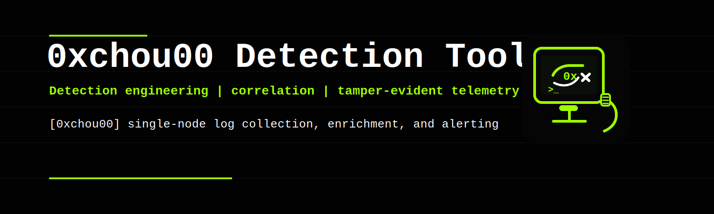

# 0xchou00 platform



0xchou00 platform is a Linux-ready SIEM and detection engineering project built to ingest SSH and web logs, normalize them into a consistent event schema, generate alerts through multiple detection layers, and preserve those artifacts inside a tamper-evident chain. The emphasis is on traceable engineering, not marketing language.

## Why this project exists

0xchou00 platform was built as a personal flagship project under the `0xchou00` identity to demonstrate practical SOC and SIEM engineering:

- event normalization across heterogeneous sources
- heuristic detection and externalized rule content
- anomaly detection without fake AI claims
- operational API and dashboard delivery
- integrity verification for stored telemetry

## Architecture

```text
log lines -> ingestion -> normalization -> detection engine -> sqlite persistence
                                                        -> integrity chain
sqlite + chain -> fastapi -> landing page + dashboard + operator endpoints
```

### Core components

- `backend/app/ingestion`
  Normalizes SSH and Apache/Nginx-style logs into a unified event schema so detectors remain source-agnostic.

- `backend/app/detection`
  Hosts the brute-force detector, suspicious-IP heuristics, YAML rule loader, and frequency anomaly detector.

- `backend/app/storage`
  Persists events, alerts, API keys, and integrity-chain entries in SQLite.

- `backend/app/services`
  Orchestrates ingestion and integrity recording so every accepted event follows the same path.

- `frontend`
  Serves the branded landing page and dashboard with a black / white / neon-green terminal aesthetic.

## Data flow

1. A client submits raw log lines through `POST /ingest`.
2. The normalizer converts each supported line into a structured `LogEvent`.
3. The detection engine evaluates the event through:
   - SSH brute-force logic
   - suspicious web-source heuristics
   - YAML-defined detection rules
   - rolling-window anomaly detection
4. Parsed events are written to SQLite.
5. Alerts are written to SQLite.
6. Both records are hash-chained in insertion order.
7. FastAPI exposes health, logs, alerts, and integrity verification.
8. The dashboard polls the API and renders current activity.

## Detection logic

### SSH brute-force

Tracks repeated authentication failures per source IP inside a rolling time window. Severity escalates when failure count materially exceeds the configured threshold.

### Suspicious IP

Flags three web behaviors with direct SOC value:

- excessive request rate
- high HTTP error ratio
- access to sensitive paths such as `/.env`, `/wp-admin`, and `/.git/config`

### YAML rules

Rule content lives in `rules/default_rules.yml`. Rules support:

- source type scoping
- event type scoping
- direct field matches
- `contains`
- `regex`
- rolling aggregation by group field

### Anomaly detection

The anomaly detector is intentionally simple and real:

- it counts events per source in fixed windows
- it builds a baseline from previous windows
- it alerts when the current window spikes beyond the baseline multiplier

## Screenshots and UI references

- Brand banner: [`media/0xchou00_banner.svg`](./media/0xchou00_banner.svg)
- Mascot / icon: [`frontend/brand-mark.svg`](./frontend/brand-mark.svg)
- Landing page route: `/`
- Dashboard route: `/dashboard`

## Linux installation

```bash
git clone https://github.com/0xchou00/0xchou00-SEIM.git
cd 0xchou00-SEIM/siem-project
chmod +x install.sh
./install.sh
```

The installer:

- creates `.venv`
- installs Python dependencies
- creates `.env`
- prepares the SQLite runtime path
- installs and enables `0xchou00.service`

## Environment

`install.sh` creates `.env` if one does not already exist:

```bash
SIEM_DB_PATH=/absolute/path/to/siem-project/backend/data/siem.db
SIEM_ADMIN_API_KEY=siem-admin-dev-key
SIEM_ANALYST_API_KEY=siem-analyst-dev-key
SIEM_VIEWER_API_KEY=siem-viewer-dev-key
```

Replace these keys before exposing the service outside a lab environment.

## Running the platform

### systemd

```bash
sudo systemctl start 0xchou00.service
sudo systemctl status 0xchou00.service
journalctl -u 0xchou00.service -f
```

### manual launch

```bash
cd backend
../.venv/bin/uvicorn main:app --host 0.0.0.0 --port 8000
```

### access points

- landing page: `http://127.0.0.1:8000/`
- dashboard: `http://127.0.0.1:8000/dashboard`
- API health: `http://127.0.0.1:8000/health`
- architecture map: `ARCHITECTURE.md`

## Real usage examples

### Ingest SSH failures

```bash
curl -X POST http://127.0.0.1:8000/ingest \
  -H "Content-Type: application/json" \
  -H "X-API-Key: siem-analyst-dev-key" \
  -d '{
    "source_type": "ssh",
    "lines": [
      "Jan 15 03:21:00 web01 sshd[1001]: Failed password for root from 203.0.113.50 port 55001 ssh2"
    ]
  }'
```

### Query alerts

```bash
curl "http://127.0.0.1:8000/alerts?since_minutes=60&source_type=ssh" \
  -H "X-API-Key: siem-viewer-dev-key"
```

### Query logs

```bash
curl "http://127.0.0.1:8000/logs?since_minutes=60&source_type=apache" \
  -H "X-API-Key: siem-viewer-dev-key"
```

### Verify integrity chain

```bash
curl http://127.0.0.1:8000/integrity/verify \
  -H "X-API-Key: siem-viewer-dev-key"
```

## Dashboard design system

The frontend identity is consistent across the project:

- black background
- white primary text
- neon green accents
- terminal typography
- glitch-adjacent cyber presentation
- CRT mascot with `0x` eye, sharp expression, RJ45 tail, and `>_` prompt

This styling is not decorative only. It makes the project visually distinct and reinforces the operator workflow rather than looking like a generic admin template.

## Documentation map

- operator install and architecture: `README.md`
- testing scenarios and expected alerts: `TESTING.md`
- branding and publication assets: `media/`

## Troubleshooting

### service does not start

```bash
sudo systemctl status 0xchou00.service
journalctl -u 0xchou00.service -n 100
```

### dashboard loads but stays empty

- confirm you entered a valid API key
- confirm logs were actually ingested
- confirm the selected time filter includes the ingest time

### integrity verification reports errors

- inspect the SQLite database path in `.env`
- confirm the database file is writable
- confirm chain-linked entities still exist in the database
